# TaskFlow

TaskFlow is a full-stack task management application built with **Spring Boot** (Backend), **Next.js** (Frontend), and **MySQL** (Database).

## 🚀 Features

- **Authentication**: Register & Login with JWT.
- **Role Management**: Admin & User roles.
- **Task Management**: Create, Read, Update, Delete tasks.
- **Filtering & Sorting**: Search tasks, filter by status/priority, sort by deadline.
- **File Upload**: Attach files to tasks.
- **Dashboard**: Visual statistics of tasks.
- **Responsive UI**: Built with TailwindCSS.

## 🛠 Tech Stack

- **Backend**: Java 17+, Spring Boot 3, Spring Security, Spring Data JPA, JWT.
- **Frontend**: Next.js 14 (App Router), TypeScript, TailwindCSS, Axios, Chart.js.
- **Database**: MySQL.

## 📦 Setup & Installation

### Prerequisites
- Java 17+
- Node.js 18+
- MySQL

### 1. Database Setup
Create a MySQL database named `taskflow`.
```sql
CREATE DATABASE taskflow;
```

### 2. Backend Setup
1. Navigate to `backend` directory.
2. Update `src/main/resources/application.properties` with your MySQL credentials.
3. Run the application:
   ```bash
   ./mvnw spring-boot:run
   ```

### 3. Frontend Setup
1. Navigate to `frontend` directory.
2. Install dependencies:
   ```bash
   npm install
   ```
3. Run the development server:
   ```bash
   npm run dev
   ```
4. Open [http://localhost:3000](http://localhost:3000).

---

## 📊 Database Schema (ER Diagram)

```mermaid
erDiagram
    USER ||--o{ TASK : "creates"
    TASK ||--o{ UPLOADED_FILE : "has"

    USER {
        Long id PK
        String fullName
        String email
        String password
        Role role
    }

    TASK {
        Long id PK
        String title
        String description
        TaskPriority priority
        TaskStatus status
        LocalDate deadline
        LocalDateTime createdAt
        LocalDateTime updatedAt
        Long user_id FK
    }

    UPLOADED_FILE {
        Long id PK
        String fileName
        String url
        Long task_id FK
    }
```



## 🧩 Class Diagram (Backend)


## 🔄 Sequence Diagram: Login


## 🔄 Sequence Diagram: Create Task


## 📝 API Endpoints

### Auth
- `POST /api/auth/register`
- `POST /api/auth/login`

### Tasks
- `GET /api/tasks` (Params: page, size, search, status, priority, sortBy)
- `POST /api/tasks`
- `GET /api/tasks/{id}`
- `PUT /api/tasks/{id}`
- `DELETE /api/tasks/{id}`

### Files
- `POST /api/files/upload`
- `DELETE /api/files/{id}`

### Dashboard
- `GET /api/dashboard/stats`
