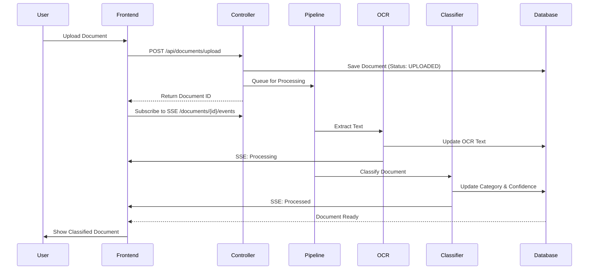

# DocClassifier 📄🤖

**DocClassifier** is an intelligent document classification platform that automatically categorizes and processes documents using OCR and machine learning. Built with **Spring Boot**, **Next.js**, and **MySQL**, it streamlines document management with automated categorization, full-text search, and real-time processing updates.

## 🚀 Features

- **🔐 Authentication**: Secure registration & login with JWT
- **📤 Document Upload**: Support for multiple document formats (PDF, images, etc.)
- **🔍 OCR Processing**: Automatic text extraction from documents
- **🤖 Auto-Classification**: AI-powered document categorization
- **🔎 Smart Search**: Full-text search across document content and filenames
- **🏷️ Tag Management**: Organize documents with custom tags
- **📊 Dashboard**: Real-time statistics and insights
- **⚡ Real-time Updates**: SSE (Server-Sent Events) for live processing status
- **📱 Responsive UI**: Modern, mobile-friendly interface

## 🛠 Tech Stack

### Backend
- **Java 17+** with Spring Boot 3
- **Spring Security** with JWT authentication
- **Spring Data JPA** with Hibernate
- **RabbitMQ** for asynchronous document processing
- **MySQL** database
- **OCR Integration** for text extraction

### Frontend
- **Next.js 14** (App Router)
- **TypeScript** for type safety
- **TailwindCSS** for styling
- **Axios** for API calls
- **Server-Sent Events** for real-time updates

### Infrastructure
- **Docker** & **Docker Compose** for containerization
- **Maven** for dependency management

## 📦 Quick Start

### Prerequisites
- **Java 17+**
- **Node.js 18+**
- **MySQL 8.0+**
- **Docker** (optional, for containerized setup)

### Option 1: Docker Setup (Recommended)

1. **Clone the repository**
   ```bash
   git clone https://github.com/KACHOURElmehdi/Docs.git
   cd Docs
   ```

2. **Start all services with Docker Compose**
   ```bash
   docker-compose up -d
   ```

3. **Access the application**
   - Frontend: [http://localhost:3000](http://localhost:3000)
   - Backend API: [http://localhost:8080](http://localhost:8080)

### Option 2: Manual Setup

#### 1. Database Setup
Create a MySQL database:
```sql
CREATE DATABASE docclassifier;
```

#### 2. Backend Setup
```bash
cd backend

# Update application.properties with your MySQL credentials
# Default configuration:
# spring.datasource.url=jdbc:mysql://localhost:3306/docclassifier
# spring.datasource.username=root
# spring.datasource.password=yourpassword

# Run the backend
./mvnw spring-boot:run
# Or on Windows:
mvnw.cmd spring-boot:run
```

The backend will start on [http://localhost:8080](http://localhost:8080)

#### 3. Frontend Setup
```bash
cd frontend

# Install dependencies
npm install

# Run the development server
npm run dev
```

The frontend will start on [http://localhost:3000](http://localhost:3000)

## 📊 Database Schema


## 🏗️ Architecture


## 📝 API Endpoints

### Authentication
| Method | Endpoint | Description | Auth Required |
|--------|----------|-------------|---------------|
| POST | `/api/auth/register` | Register new user | No |
| POST | `/api/auth/login` | Login user | No |

### Documents
| Method | Endpoint | Description | Auth Required |
|--------|----------|-------------|---------------|
| POST | `/api/documents/upload` | Upload document | Yes |
| GET | `/api/documents` | Get all documents | Yes |
| GET | `/api/documents/{id}` | Get document by ID | Yes |
| GET | `/api/documents/{id}/file` | Download document | Yes |
| GET | `/api/documents/search` | Search documents | Yes |
| POST | `/api/documents/{id}/reclassify` | Reclassify document | Yes |
| GET | `/api/documents/{id}/events` | SSE stream for processing updates | Yes |

### Categories
| Method | Endpoint | Description | Auth Required |
|--------|----------|-------------|---------------|
| GET | `/api/categories` | Get all categories | Yes |

### Statistics
| Method | Endpoint | Description | Auth Required |
|--------|----------|-------------|---------------|
| GET | `/api/stats/overview` | Get overview stats | Yes |
| GET | `/api/stats/categories` | Get category distribution | Yes |

## 🔄 Document Processing Flow



## 🎯 Document Status Flow

- **UPLOADED** → Document uploaded, awaiting processing
- **PROCESSING** → OCR and classification in progress
- **PROCESSED** → Successfully classified and ready
- **ERROR** → Processing failed (error message available)

## 🗂️ Project Structure

```
Docs/
├── backend/                 # Spring Boot backend
│   ├── src/
│   │   ├── main/
│   │   │   ├── java/com/mk/docclassifier/
│   │   │   │   ├── config/          # Security, CORS, Async configs
│   │   │   │   ├── controller/      # REST controllers
│   │   │   │   ├── domain/entity/   # JPA entities
│   │   │   │   ├── dto/             # Data transfer objects
│   │   │   │   ├── repository/      # JPA repositories
│   │   │   │   ├── security/        # JWT authentication
│   │   │   │   └── service/         # Business logic
│   │   │   └── resources/
│   │   │       └── application.properties
│   │   └── pom.xml
│   └── uploads/             # Document storage
├── frontend/                # Next.js frontend
│   ├── src/
│   │   ├── app/             # App router pages
│   │   ├── components/      # React components
│   │   ├── context/         # React context (Auth)
│   │   ├── services/        # API services
│   │   └── types/           # TypeScript types
│   └── package.json
└── docker-compose.yml       # Docker orchestration
```

## 🔒 Environment Variables

### Backend (`application.properties`)
```properties
spring.datasource.url=jdbc:mysql://localhost:3306/docclassifier
spring.datasource.username=root
spring.datasource.password=yourpassword

# JWT Secret
jwt.secret=your-secret-key-here

# File Upload
spring.servlet.multipart.max-file-size=10MB
```

### Frontend (`.env.local`)
```env
NEXT_PUBLIC_API_URL=http://localhost:8080
```

## 🧪 Testing

Test the API with the search endpoint:
```bash
curl -H "Authorization: Bearer YOUR_TOKEN" \
     "http://localhost:8080/api/documents/search?q=invoice&page=0&limit=10"
```

## 📸 Screenshots

- **Dashboard**: Overview of document statistics
- **Upload**: Drag-and-drop document upload with real-time processing
- **Search**: Smart search with filters by category and content
- **Document View**: Detailed view with OCR text, category, and confidence score

## 🤝 Contributing

Contributions are welcome! Please feel free to submit a Pull Request.

## 📄 License

This project is open source and available under the [MIT License](LICENSE).

## 👨‍💻 Author

**El Mehdi KACHOURE**  
GitHub: [@KACHOURElmehdi](https://github.com/KACHOURElmehdi)

---

**Built with ❤️ using Spring Boot & Next.js**
